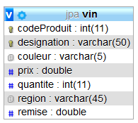

# 4 - ENTITY VIN (corrigé) : CLE PRIMAIRE COMPOSITE avec EmbeddedId (**pinard04**)

Objectif : clef composée avec une autre annotation que celle de Pinard03.

## Créer votre projet **pinard04**

- Recopier le contenu du projet gradle **pinard03** en modifiant le nom de l'application dans le *settings.gradle* et le nom du fichier de test.

On souhaite utiliser une clé primaire composite comme dans l’exercice précédent mais en utilisant l’annotation **@EmbeddedId** dans l'entity **Vin**.

Cette clé primaire sera composée du code produit et de la designation comme dans **pinard03**.

- Modifier la classe Vin

Il faut remplacer les attributs *codeProduit* et *designation* par un attribut de type **VinPK**.
Ici, on fait disparaître les 2 attributs qui seront gérés par la classe de la clef composée **VinPK**.

```java
@Entity
public class Vin implements Serializable {
    public static final long serialVersionUID=56439876525L;
    private VinPK vinPK;
    private String region;
    private String couleur;
    private double prix;
    private double remise;
    private int quantite;
```

- Ajouter l’annotation **@EmbeddedId** sur l'attribut  **VinPK** :

```java
    @EmbeddedId
    public VinPK vinPK;
```

- Ajouter l’annotation **@Transient** sur les méthodes **getCodeProduit()** et **getDesignation()** :

```java
  @Transient
    public Integer getCodeProduit() {
        return vinPK.getCodeProduit();
    }

    @Transient
    public String getDesignation() {
        return vinPK.getDesignation();
    }
```

Pourquoi cette annotation **@Transient** ?

>Bonne question. Tout simplement parce que ces deux méthodes ne doivent pas engendrer la génération des colonnes `codeProduit` et `designation` dans la table **Vin**
>puisque cela est déjà pris en charge par notre clef composée **VinPK** qui elle-même contient ces 2 attributs.

>Les colonnes seront déjà créées grâce aux annoations dans VinPK !

- Modifier ensuite la classe VinPK en lui ajoutant l’annotation **@Embeddable** :

```java
@Embeddable
public class VinPK implements Serializable {
    private Integer codeProduit;
    private String designation;
```

Les méthodes *getCodeProduit()* et *getDesignation()* pourront comporter l’annotation **@Column** pour indiquer
les colonnes en base de données qui correspondent aux propriétés codeProduit et designation.

>Sauf si vous utilisez **Lombok** dans ce cas, les annotations iront sur les attributs.

```java
public Integer getCodeProduit() {
    return codeProduit;
}

@Id
@Column(length = 50)
public String getDesignation() {
    return designation;
}
```

- Clé primaire : Rien à modifier !
- Lancez l'application avec le code ci-dessous à ajouter dans votre contrôleur (dans la méthode **home()**):

```java
@RestController
@CrossOrigin("*")
public class PinardController {
	
	@Autowired
	private VinRepository vinRepository;
	
	@GetMapping("/accueil")
	@ResponseBody
	public String home(){
		
		Vin v1=new Vin();
		VinPK pk1=new VinPK(777777,"Les Hauts du Tertre 2005");
        v1.setVinPK(pk1);
		v1.setRegion("Bordeaux (Margaux)");
		v1.setCouleur(choix.ROUGE);
		v1.setPrix(11.50);
		v1.setRemise(0);
		v1.setQuantite(2);

		Vin v2=new Vin();
		VinPK pk2=new VinPK(888888,"Château Marquis de Terme 1899");
		v2.setVinPK(pk2);
		v2.setRegion("Bordeaux (Margaux)");
		v2.setCouleur(choix.BLANC);
		v2.setPrix(19.00);
		v2.setRemise(0);
		v2.setQuantite(3);

		Vin v3=new Vin();
		VinPK pk3=new VinPK(999999,"Clos du Marquis 2007");
		v3.setVinPK(pk3);
		v3.setRegion("Bordeaux (Saint-Julien)");
		v3.setCouleur(choix.ROUGE);
		v3.setPrix(22.90);
		v3.setRemise(0);
		v3.setQuantite(15);

		Vin v4=new Vin();
		VinPK pk4=new VinPK(111111,"Clos du Baron 2015");
		v4.setVinPK(pk4);
		v4.setRegion("Bordeaux (Saint-Julien)");
		v4.setCouleur(choix.BLANC);
		v4.setPrix(45.20);
		v4.setRemise(0);
		v4.setQuantite(50);


		System.out.println("ajout du produit v1 : "+v1);
		ajoutVin(v1);

		System.out.println("ajout du produit v2 : "+v2);
		ajoutVin(v2);

		System.out.println("ajout du produit v3 : "+v3);
		v3=ajoutVin(v3);
		v3.setQuantite(10);
		updateVin(v3);

		System.out.println("ajout du produit v4 : "+v4);
		v4=ajoutVin(v4);

		updateQuantite(v4.getVinPK(),30);
		updateVin(v4);

		StringBuilder sb = new StringBuilder();
		sb.append("<h1>Regardez dans votre console et dans votre base de données MySQL <strong>JPA</strong></h1>");
		sb.append("<a href='http://localhost:8080/vins'>Voir la liste des vins enregistrés</a>");
		return  sb.toString();
	}

	

	public Optional<Vin> findById(VinPK vinPk){
		return vinRepository.findById(vinPk);
	}
	/**
	 * Retourne tous les produits dans une liste
	 */
	@GetMapping("/vins")
	public Collection<Vin> findAll(){

		return vinRepository.findAll();
	}
	/**
	 * Ajoute un vin
	 */
	public Vin ajoutVin(Vin vin){
		return vinRepository.save(vin);
	}
	/**
	 * Met un jour un enregistrement pour un objet Vin
	 */
	public Vin updateVin(Vin vin){
		return vinRepository.save(vin);
	}


	/**
	 * Met à jour la quantité d'un objet de type Vin
	 */
	public void updateQuantite(VinPK vinPk, int quantite){
		(vinRepository.getOne(vinPk)).setQuantite(quantite);
	}
}

```

- vérifier la table Vin générée dans la base de données MySQL :



Lorsque vous ajoutez `/vins` à votre url dans votre navigateur, vous voyez s'afficher les informations au format JSON avec la structure suivantes :

```json
[

    {
        "vinPK": {
            "codeProduit": 111111,
            "designation": "Clos du Baron 2015"
        },
        "region": "Bordeaux (Saint-Julien)",
        "couleur": "BLANC",
        "prix": 45.2,
        "remise": 0.0,
        "quantite": 30,
        "designation": "Clos du Baron 1998",
        "codeProduit": 111111
    },
    {
        "vinPK": {
            "codeProduit": 777777,
            "designation": "Les Hauts du Tertre 2005"
        },
        "region": "Bordeaux (Margaux)",
        "couleur": "ROUGE",
        "prix": 11.5,
        "remise": 0.0,
        "quantite": 2,
        "designation": "Les Hauts du Tertre 2005",
        "codeProduit": 777777
    },
    {
        "vinPK": {
            "codeProduit": 888888,
            "designation": "Château Marquis de Terme 1899"
        },
        "region": "Bordeaux (Margaux)",
        "couleur": "BLANC",
        "prix": 19.0,
        "remise": 0.0,
        "quantite": 3,
        "designation": "Château Marquis de Terme 1899",
        "codeProduit": 888888
    },
    {
        "vinPK": {
            "codeProduit": 999999,
            "designation": "Clos du Marquis 2007"
        },
        "region": "Bordeaux (Saint-Julien)",
        "couleur": "ROUGE",
        "prix": 22.9,
        "remise": 0.0,
        "quantite": 10,
        "designation": "Clos du Marquis 2007",
        "codeProduit": 999999
    }

]
```

- Dans votre navigateur préféré saisissez l'url ou cliquez sur ce lien [http://localhost:8080/accueil](http://localhost:8080/accueil)

[Retour vers les exercices](https://pbouget.github.io/cours/framework-back/1-jpa-orm/mapping-orm.html)

[Retour vers le cours complet](https://pbouget.github.io/cours/)
